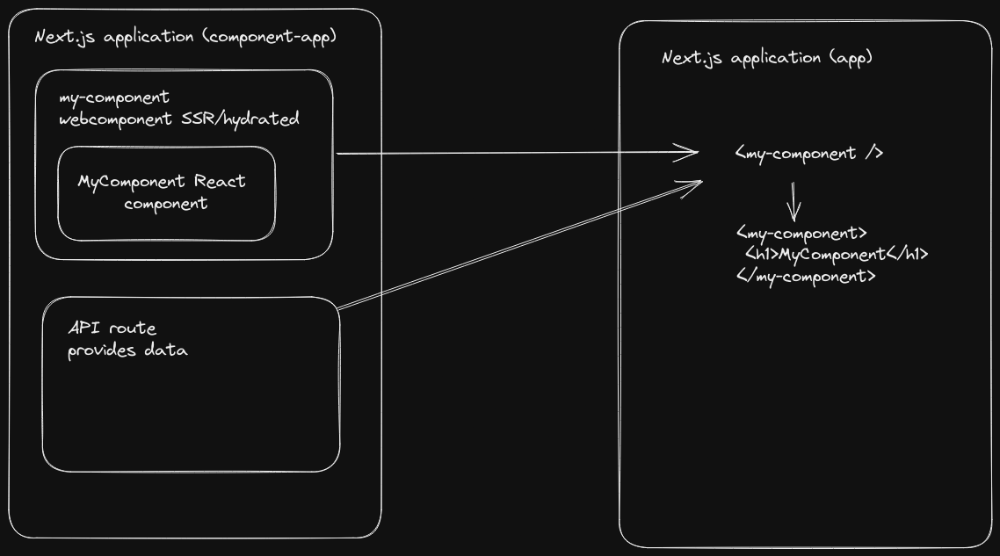

# Next.js SSR webcomponent widgets PoC
This is a proof of concept, covering the following topics:
* webcomponent that renders React components in webcomponents Shadow DOM
* SSR and client side rehydration
* Exposing the code fragments for the widget to work from the public folder of ./components-app/public, by using a webpack plugin that builds and bundles necessary dependencies and code only
* Sharing the components between Next.js apps (and probably other apps) using import via URL (e.g. `import MyComponent from 'https://example.com/my-component.js;`)

## Motivation
Using components from a Next.js application in another web application is a common use case. The code in this repository got you covered.
Example: This Twitch followers widget is a seperate website: [My Twitch follower goal](https://dashboard.twitch.tv/widgets/goal/h3nr1p). 
The demonstration in this repository, shows you how to implement something similar from your own Next.js application 

## Overview

## Resources
I used those posts, docs and implementations as a starting point and mixed it up, that it covers the requirements mentioned above:
* [Web Components in Server-Side Rendered (SSR) and Static-Site Generated (SSG) in Next.js Applications](https://www.newline.co/@kchan/web-components-in-server-side-rendered-ssr-and-static-site-generated-ssg-in-nextjs-applications--6b2e93b2)
* Exposing and importing components via URL: [NextJS URL Import React Component](https://github.com/TomasHubelbauer/next-url-import-react-component)
* Enhancing Next.js webpack to expose widgets containing necessary JS, styles and assets only: [Next-widget](https://github.com/LeMisterV/Next-widget)
* [Wrapping React Components Inside Custom Elements](https://gilfink.medium.com/wrapping-react-components-inside-custom-elements-97431d1155bd)
* [Next.js docs](https://nextjs.org/docs)
* [React docs](https://reactjs.org/docs/getting-started.html)